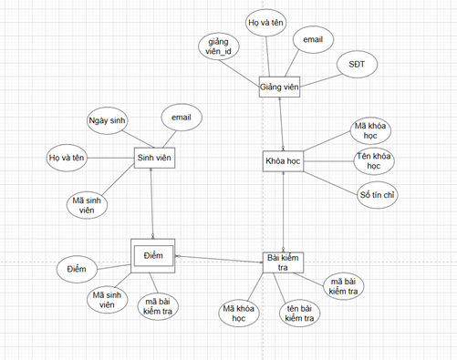

# Thiết kế CSDL ngân hàng

## a) Thiết kế lược đồ E/R cho CSDL của ngân hàng
Bao gồm thông tin về khách hàng và các tài khoản của họ:
- Thông tin về khách hàng: tên, địa chỉ, số ĐT và số căn cước (ID).
- Thông tin về tài khoản: số TK, loại tài khoản (Tk tiết kiệm, Tk tiền gửi …) và số dư.
- Một khách hàng có thể có nhiều tài khoản và nhiều khách hàng có thể cùng sở hữu một tài khoản.

## b) Thay đổi thiết kế
1. Một tài khoản chỉ có thể được sở hữu bởi một khách hàng.

2. Một khách hàng chỉ có thể sở hữu một tài khoản.

3. Mỗi khách hàng có thể có nhiều địa chỉ và nhiều số ĐT.

# Thiết kế CSDL đội bóng

## a) Thiết kế lược đồ E/R cho CSDL của các đội bóng
Bao gồm thông tin về đội, cầu thủ, các CĐV:
- Đội bóng: tên đội, các cầu thủ, đội trưởng (một trong các cầu thủ), màu áo của đội.
- Cầu thủ: tên, tuổi …
- CĐV: tên, đội ưa thích, cầu thủ ưa thích, màu ưa thích.

## b) Thay đổi/Bổ sung thiết kế
- Lưu thông tin về lịch sử chơi bóng tại các đội:
  - Thời gian bắt đầu và thời gian kết thúc khi cầu thủ chơi cho một đội.
  - Số trận, số bàn thắng, số thẻ vàng …

---

# Thiết kế CSDL trường ĐH

## a) Thiết kế lược đồ E/R cho CSDL của trường ĐH
Bao gồm thông tin về Sinh viên, Khoa, Giảng viên, Khóa học:
- Sinh viên học những khóa học nào.
- Giảng viên dạy những khóa học nào.
- Điểm của Sinh viên cho từng khóa học.
- Trợ giảng của khóa học (Trợ giảng là Sinh viên).
- Khóa học do Khoa nào phụ trách.

## b) Biểu thị điểm của Sinh viên bằng tập thực thể "Enrollments"
- "Enrollments" kết nối Sinh viên và Khóa học.
- Lưu trữ kết quả của Sinh viên trong khóa học.
- Xác định thực thể yếu và khóa của nó.

## c) Thay đổi thiết kế để lưu điểm cho mỗi bài kiểm tra
- Mỗi khóa học có thể có nhiều bài kiểm tra.
- Xác định thực thể yếu và khóa của nó.

---

# Chuyển đổi các lược đồ E/R sang lược đồ CSDL quan hệ
## a) Các lược đồ đã tạo ở các câu trước

1. Ngân hàng

2. Đội bóng
   - a) 

   - b)

3. Trường ĐH
   - a)

   - b)

   - c)

## b) Các lược đồ 
1. a)

b)
c)

